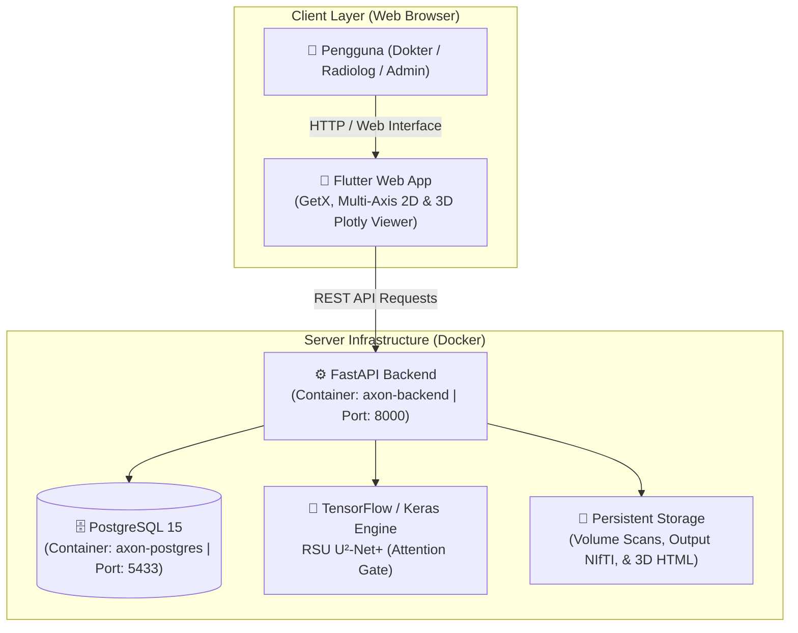

# 🧠 NeuroScan AI — 3D Brain Tumor Detection & Segmentation System

[](https://python.org)
[](https://fastapi.tiangolo.com)
[](https://tensorflow.org)
[](https://keras.io)
[](https://flutter.dev)
[](https://postgresql.org)
[](https://docker.com)

**NeuroScan AI** adalah sistem kecerdasan buatan (*Deep Learning*) kelas medis yang dirancang untuk **deteksi dan segmentasi otomatis tumor otak 3D** dari data hasil pemindaian MRI (*Magnetic Resonance Imaging*). Sistem ini mengintegrasikan model deep learning mutakhir **RSU U²-Net+ (Attention Gate)** dengan antarmuka web modern berbasis Flutter untuk dokter spesialis saraf (Sp.S), radiolog (Sp.Rad), dan administrator medis.

---

## 🎯 Kelas Segmentasi & Standar Visualisasi (BraTS 2023)

Sistem telah diselaraskan 100% dengan standar dataset BraTS 2023 dan model referensi Google Colab:

| Komponen Tumor | Label / Channel | Warna Tampilan | Perilaku di 2D (Slice) | Perilaku di 3D (Volume) |
| :--- | :---: | :---: | :--- | :--- |
| **Necrotic Tumor Core (NETC)** | Label 1 / Ch 0 | **Magenta** (`#FF00FF`) | Terlihat di inti terdalam tumor pada irisan aktif | Inti solid di bagian terdalam lesi (opacity 0.95) |
| **Peritumoral Edema** | Label 2 / Ch 1 | **Kuning** (`#FFD700`) | Massa pembengkakan luas di sekeliling inti tumor | Massa luar bervolume besar yang menyelubungi tumor (opacity 0.35) |
| **Enhancing Tumor (ET)** | Label 3 / Ch 2 | **Cyan** (`#00FFFF`) | Nodul tumor aktif di sekeliling / tepi inti nekrotik | Cangkang/nodul aktif yang membungkus inti nekrotik (opacity 0.95) |

### 🩻 Urutan Modalitas Input MRI
Sesuai konvensi standar `dataset.json`:
- `_0000`: **T1c** (T1-weighted contrast-enhanced)
- `_0001`: **T1n** (T1-weighted non-contrast)
- `_0002`: **T2f** (T2-weighted FLAIR)
- `_0003`: **T2w** (T2-weighted)

---

## 📐 Arsitektur Sistem



### Alur Kerja Utama (*Core Workflow*):
1. **Autentikasi & RBAC**: Pengguna login berdasarkan role (Admin, Dokter, Radiolog) dengan token JWT dan otorisasi ketat.
2. **Unggah MRI Scan**: Radiolog mengunggah file pemindaian MRI dalam format ZIP berisi 4 modalitas NIfTI (`.nii` / `.nii.gz`).
3. **Inference & Segmentasi AI**: FastAPI memproses volume MRI 3D menggunakan model **RSU U²-Net+ (Attention Gate)** berformat `channels_first (4, 160, 160, 16)` dengan sliding window inference dan standarisasi Z-score per slice.
4. **Ekstraksi Mesh 3D & Slice 2D**: Hasil segmentasi diubah menjadi file NIfTI per-kelas, mesh 3D Plotly WebGL (dengan opsi brain shell on/off), dan irisan 2D multi-aksial.
5. **Dynamic Peak Tumor Auto-Detection**: Backend secara otomatis menghitung irisan puncak tumor (`peak_slices`) untuk ketiga sudut pandang (Axial, Coronal, Sagittal) sehingga saat pertama kali dibuka, pengguna langsung disajikan irisan dengan lesi tumor paling jelas.

---

## ✨ Fitur Unggulan (*Key Features*)

- 🔐 **Multi-Role Access Control (RBAC)**:
  - **Admin**: Manajemen akun staff, audit trail activity log, dan sistem proteksi.
  - **Radiolog (Sp.Rad)**: Registrasi pasien baru, upload data scan MRI 3D, dan pemantauan antrean AI.
  - **Dokter Spesialis (Sp.S)**: Review hasil segmentasi AI, pemeriksaan visual 2D/3D interaktif, serta input catatan medis.
- 🩻 **Interactive 2D Slice Viewer**:
  - Navigasi 3 sudut pandang: **Axial**, **Coronal**, dan **Sagittal**.
  - Deteksi irisan puncak tumor otomatis (*auto-center on tumor*).
  - Kontrol lengkap: slider slice real-time dengan debouncing, filter layer kelas tumor, zoom in/out, rotasi, dan inversi kontras.
- 🧊 **3D WebGL Volume Render**:
  - Visualisasi 3D tumor otak (NETC, Edema, ET) berbasis Plotly WebGL.
  - Chip pemilih kelas (*Full*, *NETC*, *Edema*, *ET*) dan toggle struktur transparan jaringan otak (*Brain Shell*).
- ⚡ **Database & Query Performance Hardened**:
  - Pencegahan masalah **N+1 Query** dengan SQLAlchemy `joinedload`.
  - Penambahan indeks database pada Foreign Keys, status pemrosesan, role, dan timestamp.
  - Pembatasan aman (*query limiting*) pada endpoint polling notifikasi dan log aktivitas.
- 🛡️ **Security Hardening**:
  - Proteksi dari eksploitasi Zip-Slip (*Path Traversal*).
  - Password hashing dengan Bcrypt.
  - SQL Injection prevention via SQLAlchemy ORM.
  - CORS header hardening untuk integrasi Flutter Web.

---

## 🛠️ Technology Stack

| Layer | Komponen / Library | Deskripsi |
|-------|-------------------|-----------|
| **Frontend** | [Flutter 3.x Web](https://flutter.dev/) | Cross-platform web app dengan CanvasKit renderer |
| **State Management** | [GetX](https://pub.dev/packages/get) | Reactive state management & routing |
| **Backend Framework** | [FastAPI](https://fastapi.tiangolo.com/) | REST API performa tinggi berbasis Python 3.10+ |
| **Deep Learning** | [TensorFlow 2.18](https://tensorflow.org/) & [Keras 3](https://keras.io/) | Arsitektur RSU U²-Net+ dengan Attention Gates |
| **Medical Imaging** | [NiBabel](https://nipy.org/nibabel/) & [Scikit-Image](https://scikit-image.org/) | Pembacaan NIfTI & ekstraksi permukaan 3D (Marching Cubes) |
| **3D Visualization** | [Plotly](https://plotly.com/python/) | WebGL interactive 3D mesh rendering |
| **Database** | [PostgreSQL 15](https://www.postgresql.org/) / SQLite | Relational Database Management System |
| **ORM** | [SQLAlchemy](https://www.sqlalchemy.org/) | Python Object Relational Mapper dengan eager loading |
| **Containerization** | [Docker](https://www.docker.com/) & Docker Compose | Kontainerisasi backend & database terisolasi |

---

## 📁 Struktur Repositori

```
SistemUjiCoba/
├── .gitignore                         # Konfigurasi ignoransi file git (model weights, db, temp)
├── README.md                          # Dokumentasi Utama Repositori
├── dataset.json                       # Konfigurasi dataset & modality mapping BraTS 2023
│
├── backend-tumor/                     # Service Backend (FastAPI + TensorFlow + Database)
│   ├── .gitignore                     # Aturan ignore spesifik backend
│   ├── Dockerfile                     # Konfigurasi container backend
│   ├── docker-compose.yml             # Orchestration FastAPI & PostgreSQL
│   ├── requirements.txt               # Dependency Python
│   ├── main.py                        # Endpoint REST API & pipeline AI
│   ├── models.py                      # Skema tabel database SQLAlchemy
│   ├── schemas.py                     # Schema validasi Pydantic
│   ├── auth.py                        # Autentikasi JWT & hash password
│   ├── database.py                    # Koneksi engine & session database
│   ├── seed.py                        # Inisialisasi data awal (Users & Patients)
│   ├── checkpoints/                   # Direktori bobot model AI (model_weights.weights.h5)
│   │   └── .gitkeep
│   └── models_ai/                     # Engine Deep Learning
│       ├── __init__.py
│       ├── u2net_model.py             # Definisi arsitektur RSU U²-Net+ (Attention Gate)
│       └── inference.py               # Preprocessing, sliding window predict, & postprocessing
│
└── brain-tumor-detection-app/         # Service Frontend (Flutter Web)
    └── tumor-frontend/                # Source Code Aplikasi Flutter
        ├── pubspec.yaml               # Dependencies Flutter & Dart
        ├── lib/
        │   ├── main.dart              # Entrypoint aplikasi
        │   ├── controllers/           # GetX Controllers (Auth, Dokter, Radiolog)
        │   ├── pages/                 # Halaman UI (Dashboard, Detail Analisis, dll.)
        │   └── utils/                 # API Config, App Colors, Helpers
        └── web/                       # Konfigurasi web & index.html
```

---

## 🚀 Panduan Memulai (*Quick Start Guide*)

### 1. Prasyarat (*Prerequisites*)
- [Git](https://git-scm.com/)
- [Docker Desktop](https://www.docker.com/)
- [Flutter SDK](https://flutter.dev/) `>= 3.0.0` (jika menjalankan frontend secara lokal)
- Model checkpoint `model_weights.weights.h5` diletakkan di dalam folder `backend-tumor/checkpoints/`

---

### 2. Menjalankan Backend dengan Docker Compose

1. **Pastikan file bobot model tersedia**:
   Letakkan file `model_weights.weights.h5` pada:
   ```
   backend-tumor/checkpoints/model_weights.weights.h5
   ```

2. **Jalankan Docker Compose**:
   ```bash
   cd backend-tumor
   docker compose up -d --build
   ```

3. **Inisialisasi Data Default (Seeding)**:
   ```bash
   docker exec -it axon-backend python seed.py
   ```

4. **Akses Dokumentasi API Swagger**:
   Buka browser di: [http://localhost:8000/docs](http://localhost:8000/docs)

---

### 3. Menjalankan Frontend Flutter Web

1. **Masuk ke direktori frontend**:
   ```bash
   cd brain-tumor-detection-app/tumor-frontend
   ```

2. **Unduh dependencies**:
   ```bash
   flutter pub get
   ```

3. **Jalankan aplikasi di browser Chrome**:
   ```bash
   flutter run -d chrome
   ```

---

## 🔑 Kredensial Pengguna Default

Gunakan kredensial berikut setelah menjalankan `seed.py`:

| Peran (*Role*) | Username | Password | Deskripsi Akses |
|----------------|----------|----------|-----------------|
| **Administrator** | `admin` | `admin123` | Manajemen pengguna, audit trail activity log |
| **Dokter Spesialis** | `dokter` | `password123` | Review hasil segmentasi 2D/3D & catatan medis |
| **Radiolog** | `radiolog` | `password123` | Registrasi pasien baru & upload citra scan MRI |

---

## 🔌 Rangkuman REST API Endpoints

| Method | Endpoint | Deskripsi | Hak Akses |
|:---|:---|:---|:---|
| `POST` | `/token/` | Autentikasi & penerbitan token JWT | Public |
| `GET` | `/users/me/` | Mengambil data profil user aktif | Authenticated |
| `GET` | `/patients/` | Mengambil daftar seluruh pasien | Admin, Radiolog |
| `POST` | `/patients/` | Registrasi pasien baru | Admin, Radiolog |
| `POST` | `/upload-mri/` | Unggah file ZIP 4 modalitas MRI & mulai analisis AI | Radiolog |
| `GET` | `/scan/{scan_id}/status` | Cek status & persentase progres pemrosesan AI | Authenticated |
| `GET` | `/riwayat-semua/` | Mengambil riwayat semua scan (dioptimalkan dengan JOIN) | Authenticated |
| `GET` | `/analisis/{id}` | Detail lengkap hasil analisis, shape, & `peak_slices` | Authenticated |
| `GET` | `/analisis/{id}/slice` | Render gambar PNG irisan 2D beroverlay tumor | Authenticated |
| `GET` | `/dashboard-summary/` | Statistik ringkasan pasien & status pemrosesan | Admin, Radiolog |
| `GET` | `/logs/` | Mengambil audit trail log aktivitas pengguna | Admin |

---

## 🛡️ Lisensi & Hak Cipta

Hak Cipta © 2026 **NeuroScan AI Team**. Seluruh hak cipta dilindungi undang-undang.
