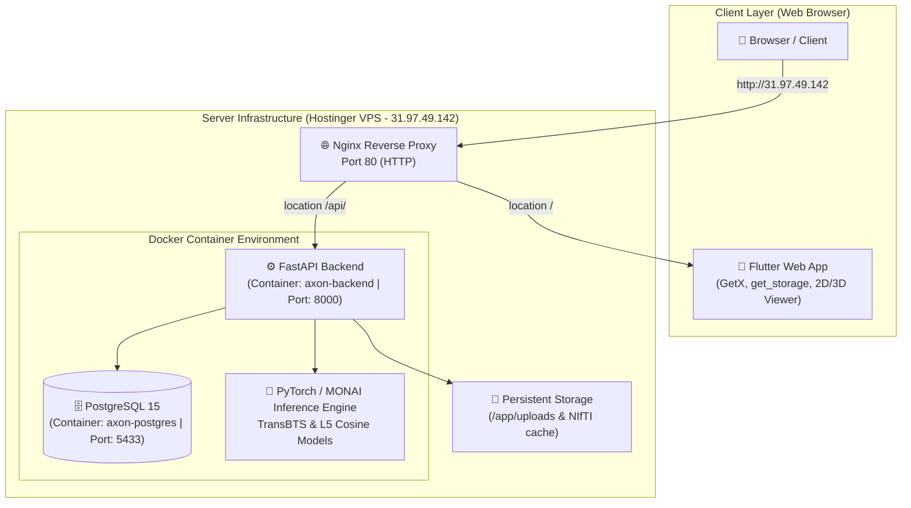

# 🧠 NeuroScan AI — 3D Brain Tumor Detection & Segmentation System

[](http://31.97.49.142)
[](https://python.org)
[](https://fastapi.tiangolo.com)
[](https://pytorch.org)
[](https://monai.io)
[](https://flutter.dev)
[](https://postgresql.org)
[](https://docker.com)

**NeuroScan AI** adalah sistem berbasis kecerdasan buatan (*Deep Learning*) kelas medis yang dirancang untuk **deteksi dan segmentasi tumor otak 3D** dari data hasil pemindaian MRI (*Magnetic Resonance Imaging*). Sistem ini menyediakan platform berbasis web yang responsif untuk dokter spesialis saraf (Sp.S), radiolog (Sp.Rad), dan administrator medis dalam mengelola pasien, menganalisis irisan MRI 2D, serta melakukan rekonstruksi visualisasi tumor 3D secara presisi.

---

## 🌐 Live Production Access

Sistem telah di-deploy dan aktif di lingkungan produksi:
- **Web Interface (Frontend)**: [http://31.97.49.142](http://31.97.49.142)
- **API Documentation (Swagger UI)**: [http://31.97.49.142/api/docs](http://31.97.49.142/api/docs)
- **VPS Hostinger**: Ubuntu 22.04 LTS (Hostinger KVM 2, 2 vCPUs, 8 GB RAM, 100 GB NVMe, 4GB SWAP)

---

## 📐 Arsitektur Sistem



### Alur Kerja Utama (*Core Workflow*):
1. **Autentikasi User**: Pengguna melakukan login berdasarkan role (Admin, Dokter, Radiolog). Token JWT diterbitkan dan disimpan secara aman menggunakan `get_storage`.
2. **Unggah MRI Scan**: Radiolog mengunggah file pemindaian MRI dalam format ZIP (berisi file NIfTI `.nii` / `.nii.gz` modalitas T1, T2, FLAIR).
3. **Inference & Segmentasi AI**: FastAPI menjalankan worker asinkron yang memanfaatkan PyTorch & MONAI untuk memproses volume MRI 3D menggunakan model AI TransBTS / L5 Cosine.
4. **Dynamic Slice Selection**: Sistem secara otomatis menentukan irisan (*slice*) 2D optimal dengan luas wilayah tumor terbesar (*maximum tumor area*) untuk disajikan ke dokter.
5. **Visualisasi 3D Interaktif**: Membangun mesh/objek 3D tumor dan area sekitar otak yang dapat diputar, di-zoom, dan dianalisis melalui web viewer.

---

## ✨ Fitur Utama (*Key Features*)

- 🔐 **Multi-Role Access Control (RBAC)**: Hak akses khusus sesuai peran:
  - **Admin**: Manajemen akun staff/dokter, audit trail activity log, dan sistem proteksi.
  - **Radiolog (Sp.Rad)**: Registrasi pasien baru, upload data scan MRI 3D, dan pemicu analisis AI.
  - **Dokter Spesialis (Sp.S)**: Review hasil segmentasi AI, pemeriksaan visual 2D/3D, pembaruan catatan klinis pasien.
- 🩻 **Analisis Irisan 2D Multi-Aksial**: Menampilkan irisan aksial, sagital, dan koronal dengan fitur zoom, rotasi, serta penyesuaian kontras (*contrast inversion*).
- 🧊 **Visualisasi Volume 3D Interaktif**: Rekonstruksi 3D tumor otak (NETC, SNFH, ET, RC) langsung dari browser.
- 🎯 **Dynamic Tumor Slice Auto-Detection**: Algoritma cerdas yang memilih slice dengan tumor terluas atau volume otak terbesar secara otomatis.
- 📊 **Audit Trail & Monitoring Activity**: Pencatatan riwayat aktivitas pengguna untuk transparansi medis dan keamanan data.
- 🛡️ **Security Hardening**: Proteksi dari kerentanan Zip-Slip (Path Traversal), SQL Injection via SQLAlchemy ORM, Hashing Password Bcrypt, dan CORS Hardening.

---

## 🛠️ Technology Stack

| Layer | Teknologi | Deskripsi |
|-------|-----------|-----------|
| **Frontend Framework** | [Flutter 3.x Web](https://flutter.dev/) | Framework UI cross-platform berbasis Dart |
| **State Management** | [GetX](https://pub.dev/packages/get) & `get_storage` | Manajemen state reactive dan penyimpanan session JWT |
| **Backend API** | [FastAPI](https://fastapi.tiangolo.com/) | REST API framework performa tinggi berbasis Python 3.10 |
| **AI / Machine Learning** | [PyTorch 2.5.1](https://pytorch.org/) & [MONAI 1.3.0](https://monai.io/) | Deep Learning framework untuk segmentasi citra medis 3D |
| **Database** | [PostgreSQL 15](https://www.postgresql.org/) | Relational Database Management System |
| **ORM** | [SQLAlchemy](https://www.sqlalchemy.org/) | Python Object Relational Mapper |
| **Containerization** | [Docker](https://www.docker.com/) & Docker Compose | Kontainerisasi backend dan database |
| **Web Server / Proxy** | [Nginx](https://nginx.org/) | Reverse proxy, SSL handling, & static content hosting |

---

## 📁 Struktur Repositori (*Repository Structure*)

```
NeuroScanv2/
├── README.md                      # Dokumentasi Utama Repositori
├── project_final_documentation.md # Dokumentasi Teknis Deployment & Maintenance VPS
├── demo_api.py                    # Script Demo Pengujian REST API via Python
│
├── backend-tumor/                 # Service Backend (FastAPI + PyTorch + PostgreSQL)
│   ├── README.md                  # Dokumentasi Spesifik Backend
│   ├── main.py                    # Aplikasi Utama FastAPI & Engine AI
│   ├── models.py                  # Skema Database SQLAlchemy
│   ├── schemas.py                 # Schema Pydantic Request/Response
│   ├── auth.py                    # Otentikasi JWT & Hashing Bcrypt
│   ├── database.py                # Koneksi & Session Database
│   ├── seed.py                    # Script Inisialisasi Data Awal (Users & Patients)
│   ├── Dockerfile                 # Konfigurasi Build Container Backend
│   ├── docker-compose.yml         # Orchestration Container FastAPI & Postgres
│   ├── requirements.txt           # Dependency Python
│   ├── .env.example               # Template Variabel Lingkungan
│   ├── best_model.pth             # Bobot Model AI Paper TransBTS (~348 MB)
│   └── L5FINAL3_COSINE_best_model.pth # Bobot Model AI Optimisasi L5 (~4 MB)
│
└── brain-tumor-detection-app/     # Service Frontend (Flutter Web)
    ├── README.md                  # Dokumentasi Spesifik Frontend
    └── tumor-frontend/            # Source Code Flutter Web Project
        ├── README.md              # Developer Quick Reference Frontend
        ├── pubspec.yaml           # Dependencies Flutter / Dart
        ├── lib/                   # Kode Sumber UI, Controllers, & Services
        └── web/                   # Entry point Web & CanvasKit assets
```

---

## 🚀 Panduan Memulai (*Quick Start Guide*)

### Prasyarat (*Prerequisites*)
- **Git** (versi terbaru)
- **Docker Desktop** (untuk pengujian backend & database lokal)
- **Flutter SDK** `>=3.0.0` (opsional jika ingin mengembangkan frontend)
- **Python** `3.10+` (opsional jika ingin menjalankan backend tanpa Docker)

---

### Cara 1: Menjalankan Seluruh Sistem dengan Docker Compose (Direkomendasikan)

1. **Clone Repositori**:
   ```bash
   git clone https://github.com/nabilaekasd/backend-tumor.git
   cd NeuroScanv2/backend-tumor
   ```

2. **Konfigurasi Environment**:
   Salin file `.env.example` menjadi `.env`:
   ```bash
   cp .env.example .env
   ```

3. **Jalankan Backend & Database**:
   ```bash
   docker compose up -d --build
   ```
   *Catatan: Proses build pertama membutuhkan waktu 5-15 menit untuk mengunduh dependency PyTorch & MONAI.*

4. **Inisialisasi Database (Seeding)**:
   ```bash
   docker exec -it axon-backend python seed.py
   ```

5. **Akses API Documentation**:
   Buka browser dan navigasi ke: [http://localhost:8000/docs](http://localhost:8000/docs)

---

### Cara 2: Menjalankan Frontend Flutter Web (Lokal Development)

1. Navigasi ke folder frontend:
   ```bash
   cd brain-tumor-detection-app/tumor-frontend
   ```

2. Unduh packages/dependencies:
   ```bash
   flutter pub get
   ```

3. Jalankan aplikasi di Google Chrome:
   ```bash
   flutter run -d chrome
   ```

---

## 🔑 Kredensial Default (*Default Credentials*)

Setelah me-run script `seed.py`, Anda dapat login menggunakan kredensial default berikut:

| Peran (*Role*) | Username | Password | Deskripsi Akses |
|----------------|----------|----------|-----------------|
| **Administrator** | `admin` | `admin123` | Akses penuh manajemen user & log sistem |
| **Dokter Saraf** | `dokter` | `password123` | Akses review riwayat scan & update catatan medis |
| **Radiolog** | `radiolog` | `password123` | Akses registrasi pasien & upload MRI scan |

---

## 🔌 API Endpoints Summary

| Method | Endpoint | Deskripsi | Hak Akses |
|--------|----------|-----------|-----------|
| `POST` | `/token/` | Login & mendapatkan JWT Access Token | Public |
| `GET` | `/users/me/` | Mengambil data profil user terotentikasi | All Roles |
| `GET` | `/patients/` | Mengambil daftar data pasien | All Roles |
| `POST` | `/patients/` | Registrasi data pasien baru | Admin, Radiolog |
| `POST` | `/upload-mri/` | Unggah file scan MRI 3D (ZIP) & jalankan segmentasi AI | Radiolog |
| `GET` | `/scan/{scan_id}/status` | Checking status & persentase progres pemrosesan AI | All Roles |
| `GET` | `/analisis/{id}/slice` | Mengambil irisan gambar 2D MRI (Sagittal/Coronal/Axial) | All Roles |
| `GET` | `/analisis/{id}/info` | Mengambil detail metrik evaluasi & info scan | All Roles |
| `GET` | `/dashboard-summary/` | Mengambil statistik ringkasan dashboard | Admin, Radiolog |
| `GET` | `/logs/` | Mengambil audit trail log aktivitas pengguna | Admin |

---

## 📄 Dokumentasi Terkait

- 📗 **[Backend Technical Specs](file:///c:/Sempro/NeuroScanv2/backend-tumor/README.md)**: Panduan detail arsitektur FastAPI, PyTorch, SQLAlchemy, dan endpoint REST API.
- 📘 **[Frontend Technical Specs](file:///c:/Sempro/NeuroScanv2/brain-tumor-detection-app/README.md)**: Panduan detail arsitektur Flutter Web, GetX, dan visualisasi 3D.
- 📙 **[Deployment & Production Guide](file:///c:/Sempro/NeuroScanv2/project_final_documentation.md)**: Laporan lengkap deployment VPS Hostinger, Nginx reverse proxy, backup cron job, dan panduan maintenance server.

---

## 🛡️ Lisensi & Hak Cipta

Copyright © 2026 **NeuroScan AI Team**. All Rights Reserved.
